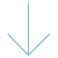

	 
		
	 

<h2>𝐇𝐞𝐥𝐥𝐨 𝐭𝐡𝐞𝐫𝐞.</h2>
<h1> &nbsp;&nbsp;&nbsp;I'm Ameer Suhail </h1>

## A little about me...  

I'm a **Tech Enthusiast 💻 😃** passionate about learning and working with new tech. I love building interesting and amazing products that serve a great deal of purpose.One thing that makes me standout from the crowd is that, I was a civi engineering graduate and right now i self taught some of the most in demand skills for web development and build projects. I believe, that is one skill that every programmer should have and not just sticking on to one thing and learning more and more new technologies as per needs.  	

## ⚡️ A Few Quick Facts

-🌐&nbsp;&nbsp;Finding something i don't know drives me restless till i research and get it solved. 
-📖&nbsp;&nbsp;Can learn new technologies without a second thought if the problem to solve asks for it. 
-💬&nbsp;&nbsp;Ask me about Python, HTML, CSS, JavaScript. 
-🔭&nbsp;&nbsp;I’m currently working on my pet projects.  
<h3>🎉  Fun-Fact :</h3> I ❤️ to update knowledge on tech, literally pass my time watching tech reviews by MKBHD, MrWhoseTheBoss, etc. Also, watch a lot of Sci-Fi and future depicting Movies🎬   

 

<h2> My DevSetup</h2> 
      

<h2> Some Tools and Tech I use</h2> 
<code></code>&nbsp;
<code></code>&nbsp;
<code></code>&nbsp;
<code></code>&nbsp;
<code></code> 

<h2> What I am currently learning </h2> 

&nbsp;

&nbsp;
&nbsp;

&nbsp;

<h2 align="center"> Feel free to connect</h2> 

  &nbsp;&nbsp;&nbsp;&nbsp;
  &nbsp;&nbsp;&nbsp;&nbsp;
  

### checkout out my repos here 

